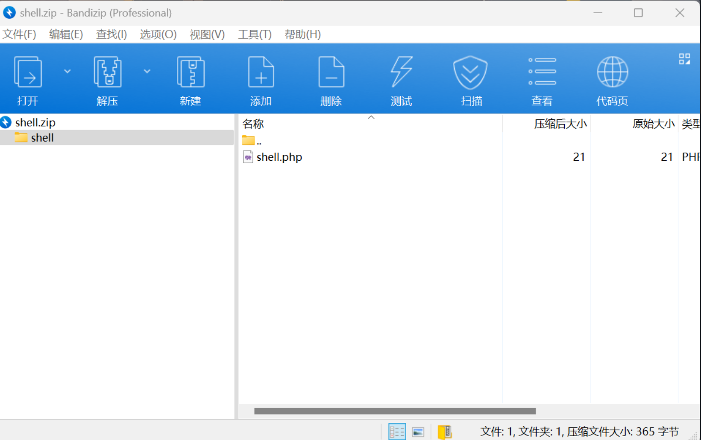

## EmlogPro最新版本2.5.3 zip解压缩RCE

EmlogPro最新版本2.5.3的插件安装功能存在zip文件上传RCE漏洞

漏洞代码在`admin\plugin.php`可以上传zip文件
```php
if ($action == 'upload_zip') {
    if (defined('APP_UPLOAD_FORBID') && APP_UPLOAD_FORBID === true) {
        emMsg('系统禁止上传安装应用');
    }
    LoginAuth::checkToken();
    $zipfile = isset($_FILES['pluzip']) ? $_FILES['pluzip'] : '';

    if ($zipfile['error'] == 4) {
        emDirect("./plugin.php?error_d=1");
    }
    if ($zipfile['error'] == 1) {
        emDirect("./plugin.php?error_g=1");
    }
    if (!$zipfile || $zipfile['error'] >= 1 || empty($zipfile['tmp_name'])) {
        emMsg('插件上传失败， 错误码：' . $zipfile['error']);
    }
    if (getFileSuffix($zipfile['name']) != 'zip') {
        emDirect("./plugin.php?error_f=1");
    }

    $ret = emUnZip($zipfile['tmp_name'], '../content/plugins/', 'plugin');
    switch ($ret) {
        case 0:
            emDirect("./plugin.php?activate_install=1");
            break;
        case -1:
            emDirect("./plugin.php?error_e=1");
            break;
        case 1:
        case 2:
            emDirect("./plugin.php?error_b=1");
            break;
        case 3:
            emDirect("./plugin.php?error_c=1");
            break;
    }
}
```
跟踪emUnZip方法发现没有对压缩包内容进行检查直接解压缩
```php
function emUnZip($zipfile, $path, $type = 'tpl')
{
    if (!class_exists('ZipArchive', FALSE)) {
        return 3; //zip模块问题
    }
    $zip = new ZipArchive();
    if (@$zip->open($zipfile) !== TRUE) {
        return 2; //文件权限问题
    }
    $r = explode('/', $zip->getNameIndex(0), 2);
    $dir = isset($r[0]) ? $r[0] . '/' : '';
    switch ($type) {
        case 'tpl':
            $re = $zip->getFromName($dir . 'header.php');
            if (false === $re) {
                return -2;
            }
            break;
        case 'plugin':
            $plugin_name = substr($dir, 0, -1);
            $re = $zip->getFromName($dir . $plugin_name . '.php');
            if (false === $re) {
                return -1;
            }
            break;
        case 'backup':
            $sql_name = substr($dir, 0, -1);
            if (getFileSuffix($sql_name) != 'sql') {
                return -3;
            }
            break;
        case 'update':
            break;
    }
    if (true === @$zip->extractTo($path)) {
        $zip->close();
        return 0;
    }

    return 1; //文件权限问题
}
```
那么我们构造一个含有php文件代码的zip压缩包


注意：文件夹名字需要和php的前缀相同（原因是`plugin_name`是由文件夹名取得值，不然`$zip->getFromName`为false会出错
```php
    $r = explode('/', $zip->getNameIndex(0), 2);
    $dir = isset($r[0]) ? $r[0] . '/' : '';
......
	$plugin_name = substr($dir, 0, -1);
    $re = $zip->getFromName($dir . $plugin_name . '.php');
     if (false === $re) {
                return -1;
            }
```

访问plugins目录下的shell.php成功解析运行php代码
```r
/content/plugins/shell/shell.php
```


## 文件包含

init.php
```r
$active_plugins = Option::get('active_plugins');

$emHooks = [];

if ($active_plugins && is_array($active_plugins)) {

    foreach ($active_plugins as $plugin) {

        if (true === checkPlugin($plugin)) {

            include_once(EMLOG_ROOT . '/content/plugins/' . $plugin);

        }

    }

}
```