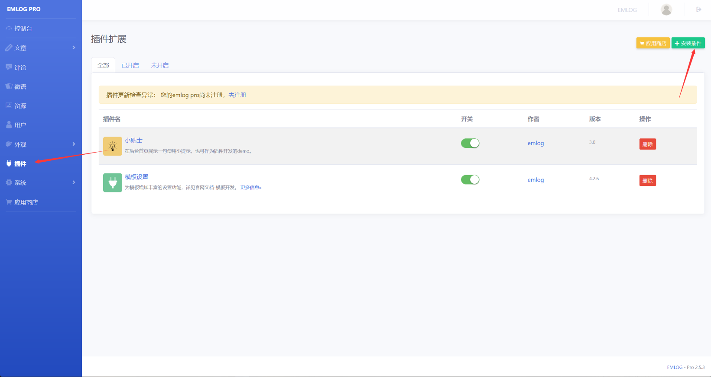

## EmlogPro Latest Version 2.5.3 Zip Extraction RCE

The latest version 2.5.3 of EmlogPro contains a zip file upload RCE vulnerability in its plugin installation feature.



The vulnerable code is in `admin\plugin.php`, where it allows uploading zip files:

```php
if ($action == 'upload_zip') {
    if (defined('APP_UPLOAD_FORBID') && APP_UPLOAD_FORBID === true) {
        emMsg('System prohibits uploading installation applications');
    }
    LoginAuth::checkToken();
    $zipfile = isset($_FILES['pluzip']) ? $_FILES['pluzip'] : '';

    if ($zipfile['error'] == 4) {
        emDirect("./plugin.php?error_d=1");
    }
    if ($zipfile['error'] == 1) {
        emDirect("./plugin.php?error_g=1");
    }
    if (!$zipfile || $zipfile['error'] >= 1 || empty($zipfile['tmp_name'])) {
        emMsg('Plugin upload failed, Error code: ' . $zipfile['error']);
    }
    if (getFileSuffix($zipfile['name']) != 'zip') {
        emDirect("./plugin.php?error_f=1");
    }

    $ret = emUnZip($zipfile['tmp_name'], '../content/plugins/', 'plugin');
    switch ($ret) {
        case 0:
            emDirect("./plugin.php?activate_install=1");
            break;
        case -1:
            emDirect("./plugin.php?error_e=1");
            break;
        case 1:
        case 2:
            emDirect("./plugin.php?error_b=1");
            break;
        case 3:
            emDirect("./plugin.php?error_c=1");
            break;
    }
}
```

Upon tracking the `emUnZip` method, we found that it does not perform any checks on the contents of the zip file and directly extracts it:

```php
function emUnZip($zipfile, $path, $type = 'tpl')
{
    if (!class_exists('ZipArchive', FALSE)) {
        return 3; // Zip module issue
    }
    $zip = new ZipArchive();
    if (@$zip->open($zipfile) !== TRUE) {
        return 2; // File permission issue
    }
    $r = explode('/', $zip->getNameIndex(0), 2);
    $dir = isset($r[0]) ? $r[0] . '/' : '';
    switch ($type) {
        case 'tpl':
            $re = $zip->getFromName($dir . 'header.php');
            if (false === $re) {
                return -2;
            }
            break;
        case 'plugin':
            $plugin_name = substr($dir, 0, -1);
            $re = $zip->getFromName($dir . $plugin_name . '.php');
            if (false === $re) {
                return -1;
            }
            break;
        case 'backup':
            $sql_name = substr($dir, 0, -1);
            if (getFileSuffix($sql_name) != 'sql') {
                return -3;
            }
            break;
        case 'update':
            break;
    }
    if (true === @$zip->extractTo($path)) {
        $zip->close();
        return 0;
    }

    return 1; // File permission issue
}
```

Thus, we can create a zip archive containing a PHP file with malicious code:


**Note**: The folder name must match the PHP file prefix because `$plugin_name` is derived from the folder name. If it doesn't match, `$zip->getFromName` will return false, and the operation will fail:

```php
    $r = explode('/', $zip->getNameIndex(0), 2);
    $dir = isset($r[0]) ? $r[0] . '/' : '';
......
    $plugin_name = substr($dir, 0, -1);
    $re = $zip->getFromName($dir . $plugin_name . '.php');
    if (false === $re) {
        return -1;
    }
```

By accessing the `plugins` directory, we can successfully execute the PHP code contained in `shell.php`:

```r
/content/plugins/shell/shell.php
```


