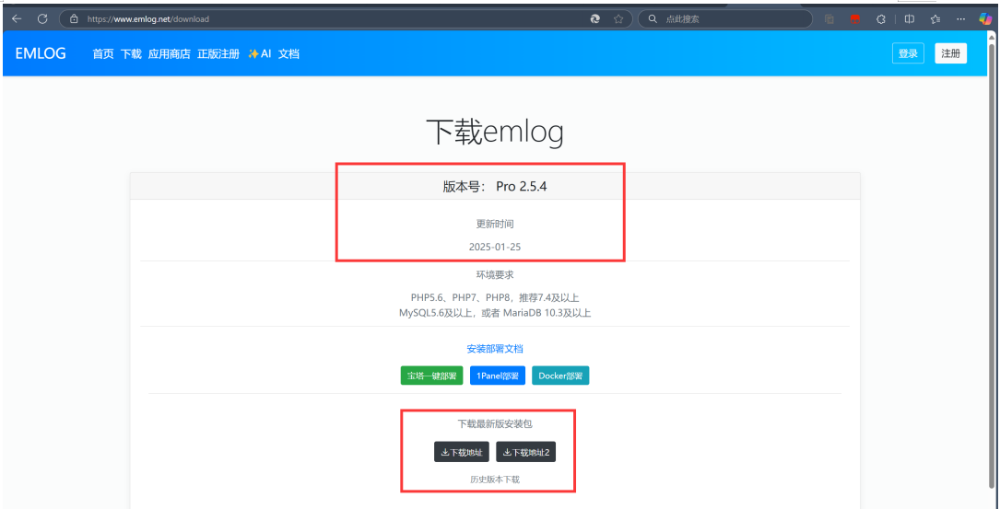
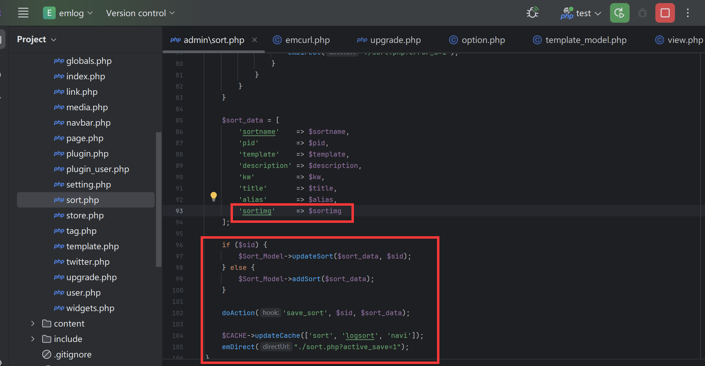
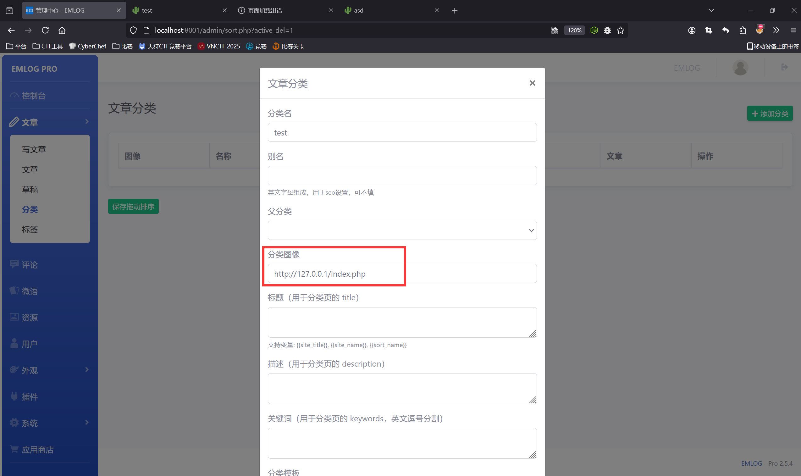
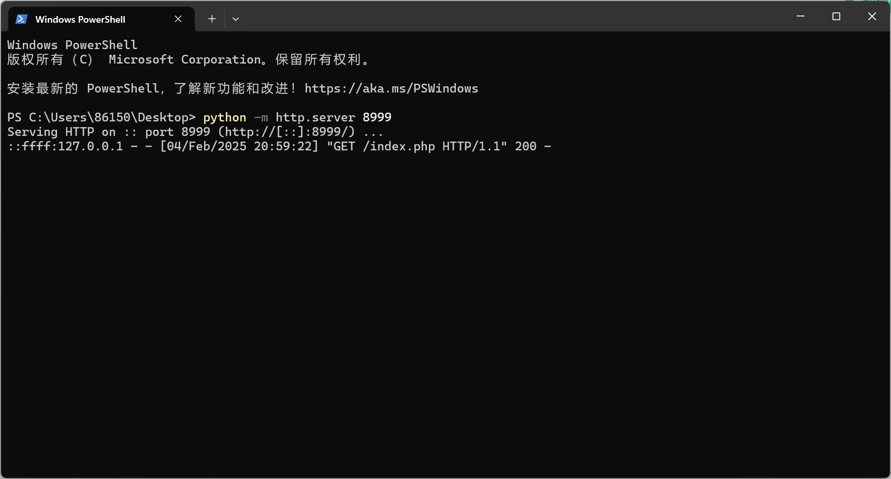

### Vulnerability Description

There is an SSRF (Server-Side Request Forgery) vulnerability in `sort.php` of the latest version 2.5.4 of EmlogPro. This vulnerability arises due to insufficient input validation and sanitization, allowing an attacker to scan local and internal ports, which can lead to attacks on local and internal services.


Official website: [https://www.emlog.net/](https://www.emlog.net/)  
Source code repository: [https://www.emlog.net/download](https://www.emlog.net/download)  
Source code version and download link:  
EmlogPro 2.5.4 - (2025-01-25 latest version)


### Vulnerability Exploitation
First, start a local service on port 8999 and place an `index.php` file to simulate an internal network service:

```python
python -m http.server 8999
```

Next, go to the article categories in the backend, where we can input a remote image URL. This area has an SSRF vulnerability.

We debugged and found the code: It can be seen that there is no validation or filtering on the image URL, which leads to the vulnerability.


POC:
```python
http://127.0.0.1:8999/index.php
```



As we can see, the internal service port successfully received the request.
