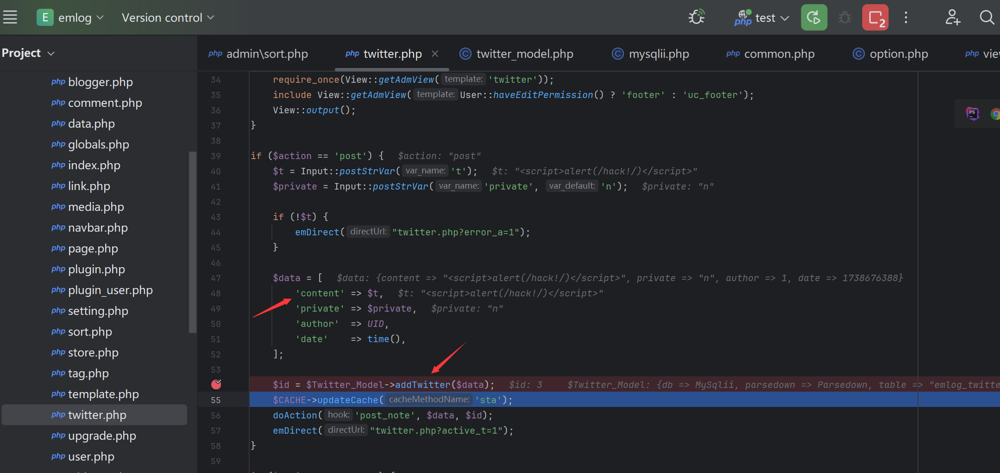
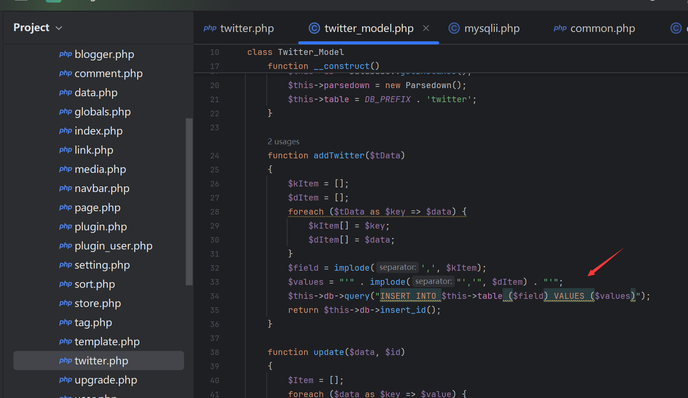
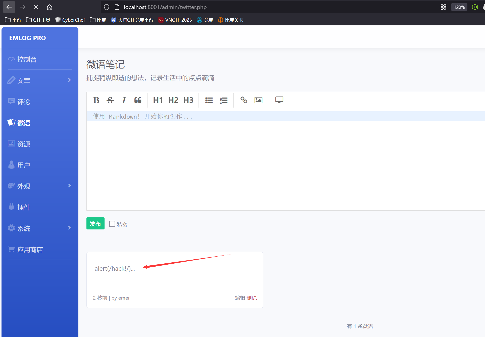
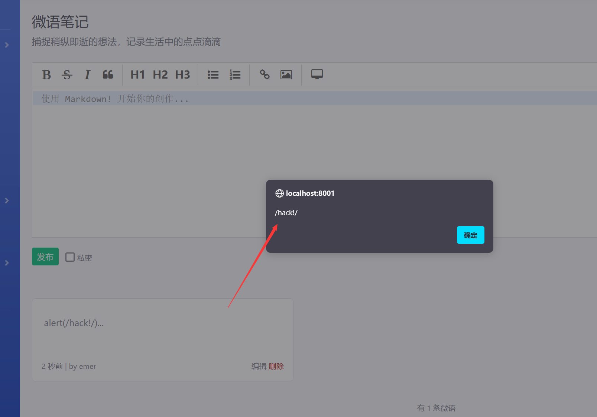

## Vulnerability Description
There is a stored XSS vulnerability in `article_save.php` of the latest version 2.5.4 of EmlogPro. This vulnerability occurs due to insufficient input validation and sanitization, allowing an attacker to inject malicious scripts into web pages that are then executed in the browsers of other users.

Official website: [https://www.emlog.net/](https://www.emlog.net/)  
Source code repository: [https://www.emlog.net/download](https://www.emlog.net/download)  
Source code version and download link:  
EmlogPro 2.5.4 - (2025-01-25 latest version)


## Vulnerability Attack

The code file is located in `admin/twitter.php`, and due to the lack of input validation, malicious data can be directly inserted into the database.



Now, in the backend, go to the micro-blog note feature and input the following POC to publish the note:
```r
<script>alert(/hack!/)</script>
```

Then, click on the note.

The XSS is successfully triggered.
