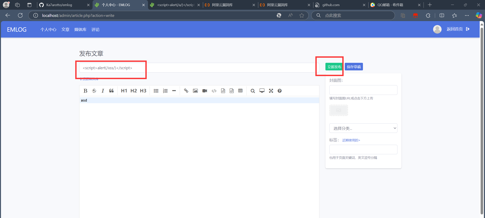
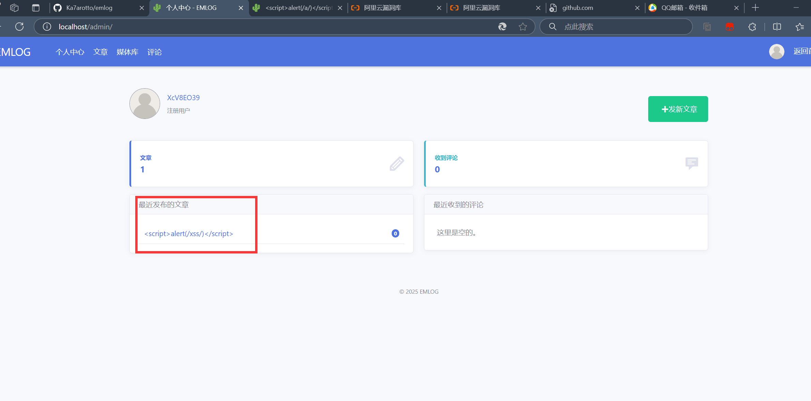
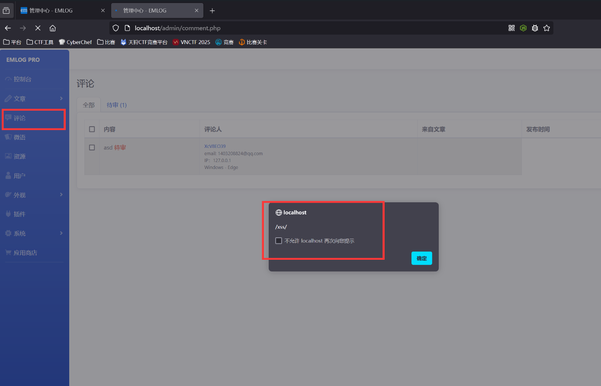
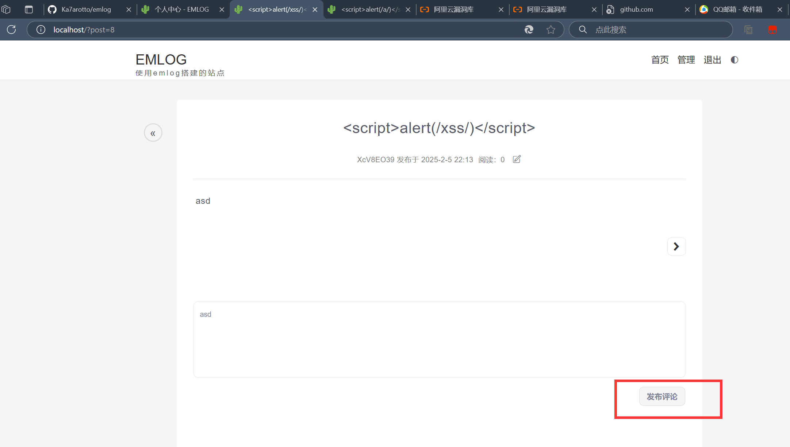
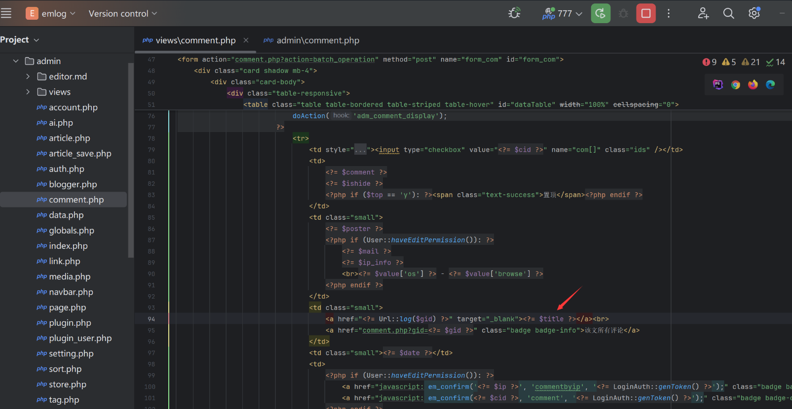

### Vulnerability Description

EmlogPro version 2.5.4 has a stored XSS vulnerability. These vulnerabilities occur due to insufficient input validation and sanitization, allowing an attacker to inject malicious scripts into the database through a normal user account. When the backend administrator enters the comment management page, the malicious code is automatically inserted into the page, triggering the XSS vulnerability.

### Attack Process

First, we register a normal account, publish an article, and insert an XSS payload in the article header:
```js
<script>alert(/xss/)</script>
```

Then we go to the homepage and click on the newly published article.


Next, we comment on the article, and the comment record will appear in the backend.


When the administrator logs in to the backend and clicks on the comment management functionality, the XSS vulnerability is triggered:
```
http://localhost/admin/comment.php
```


The vulnerability exists because in `admin/views/comment.php`, the article title is directly inserted into the HTML page without any filtering.
