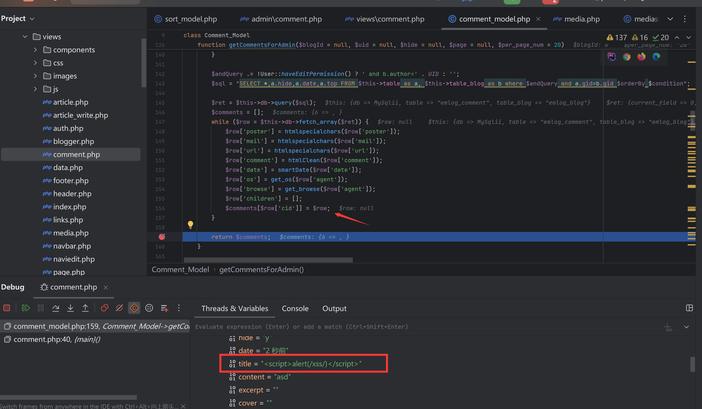
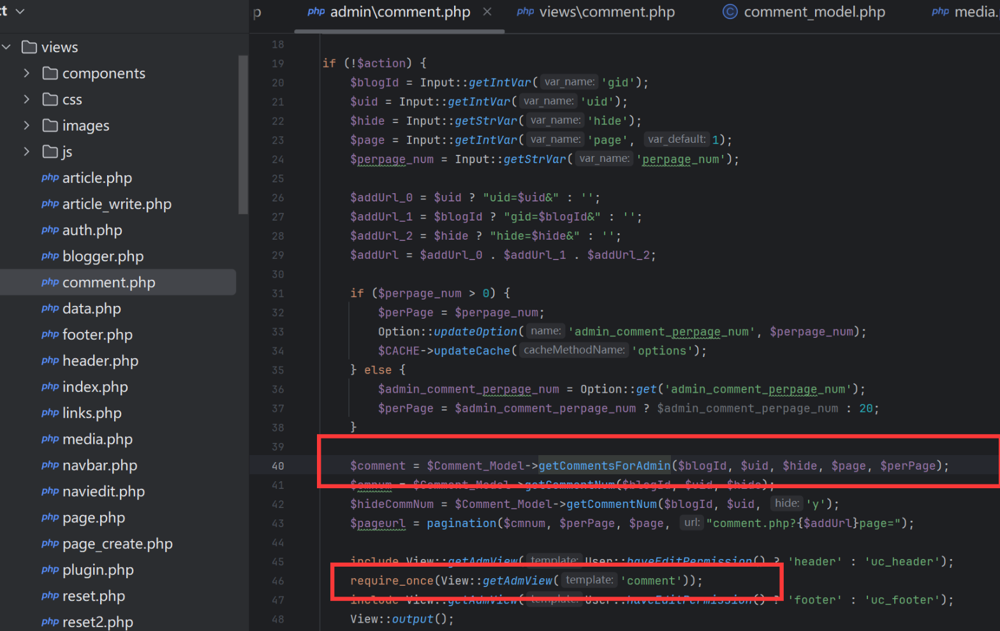

### Vulnerability Description

EmlogPro version 2.5.4 has a stored XSS vulnerability. These vulnerabilities occur due to insufficient input validation and sanitization, allowing an attacker to inject malicious scripts into the database through a normal user account. When the backend administrator enters the comment management page, the malicious code is automatically inserted into the page, triggering the XSS vulnerability.

Official website: [https://www.emlog.net/](https://www.emlog.net/)  
Source code repository: [https://www.emlog.net/download](https://www.emlog.net/download)  
Source code version and download link:  
EmlogPro 2.5.4 - (2025-01-25 latest version)


### Attack Process

First, we register a normal account, publish an article, and insert an XSS payload in the article header:
```js
<script>alert(/xss/)</script>
```

Then we go to the homepage and click on the newly published article.


Next, we comment on the article, and the comment record will appear in the backend.


When the administrator logs in to the backend and clicks on the comment management functionality, the XSS vulnerability is triggered:
```
http://localhost/admin/comment.php
```


###  Debugging analysis
Debugging found that the vulnerability was caused by the vulnerability file include/model/comment_model.php, and the getCommentsForAdmin function did not perform any filtering on the title taken out of the database.



And admin/comment.php directly calls the getCommentsForAdmin function to retrieve data from the database. The file contains the rendering admin/views/comment.php html template.


In admin/views/comment.php, the article title is directly inserted into the html page.
