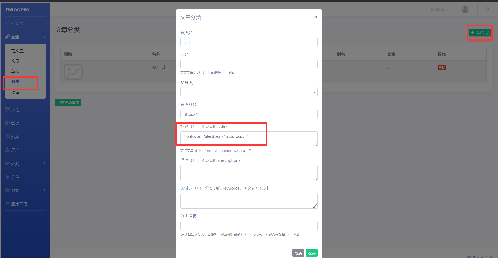
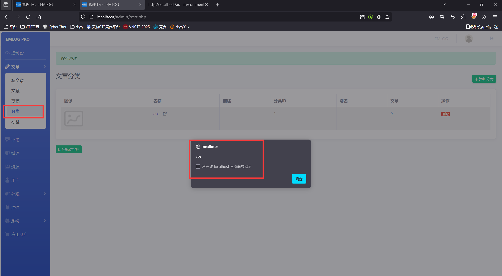
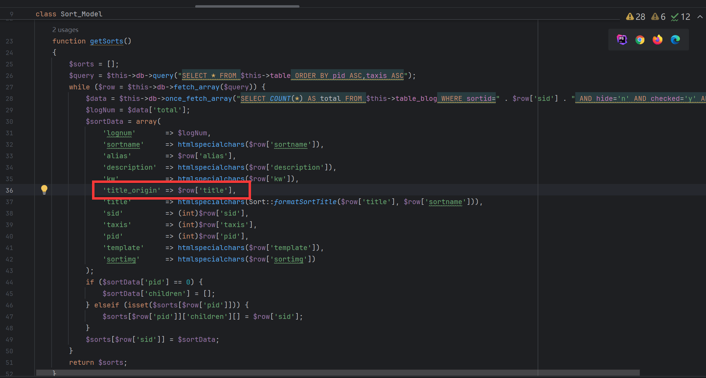
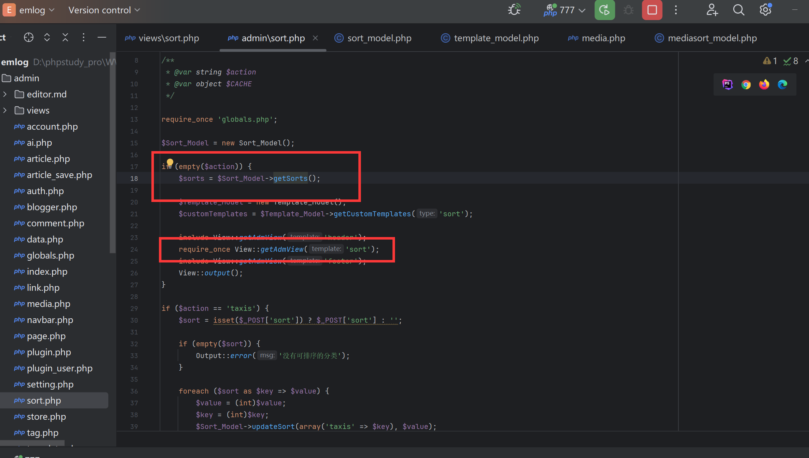
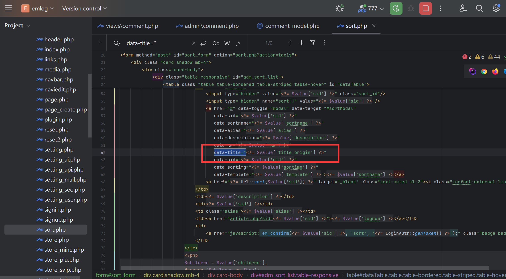

### Vulnerability Description

EmlogPro version 2.5.4 has a stored XSS vulnerability in the article category feature. These vulnerabilities occur due to insufficient input validation and sanitization, allowing an attacker to inject malicious scripts into the database through a normal user account. When the backend administrator enters the comment management page, the malicious code is automatically inserted into the page, triggering the XSS vulnerability.

Official website: [https://www.emlog.net/](https://www.emlog.net/)  
Source code repository: [https://www.emlog.net/download](https://www.emlog.net/download)  
Source code version and download link:  
EmlogPro 2.5.4 - (2025-01-25 latest version)


### Attack Process

In the backend, we go to the article category section and insert the following payload in the title:
```r
" onfocus="alert('xss');" autofocus="
```
Then, select "Publish."



When we click on the category feature again, the stored XSS vulnerability is triggered.


### Vulnerability Cause

We followed up on the vulnerability file: include/model/mediasort_model.php->getSorts() and found that only title was not filtered.




The file admin\sort.php calls the getSorts function to retrieve data from the database, and then it includes the admin/views/sort.php HTML template page.




The file includes admin/views/sort.php and directly inserts title_origin into the HTML page without any filtering.


