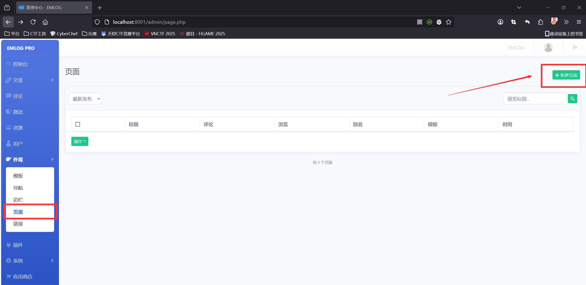
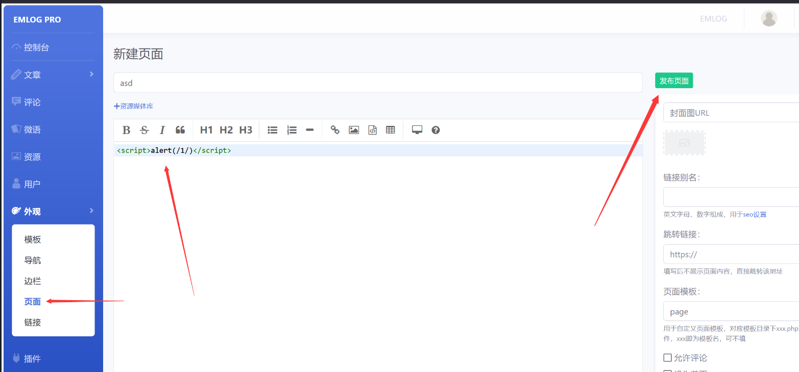
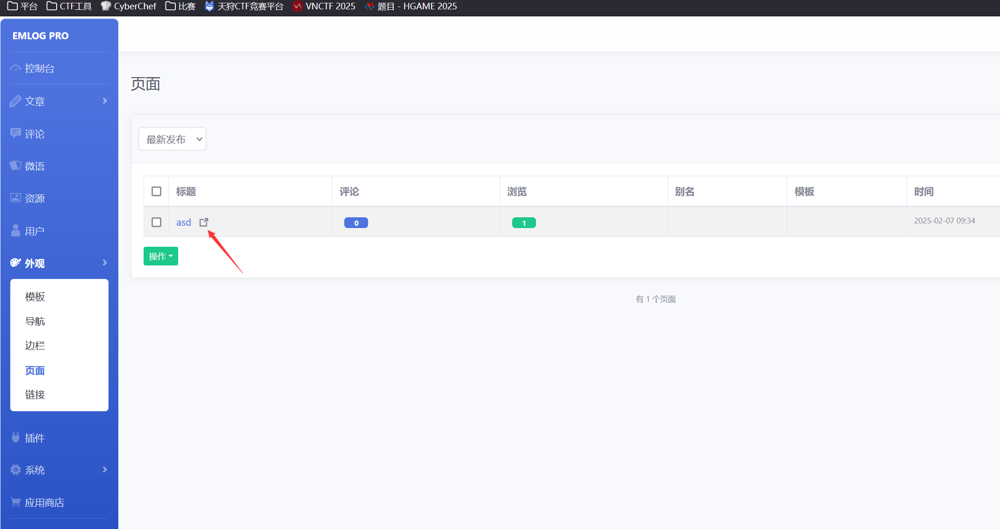
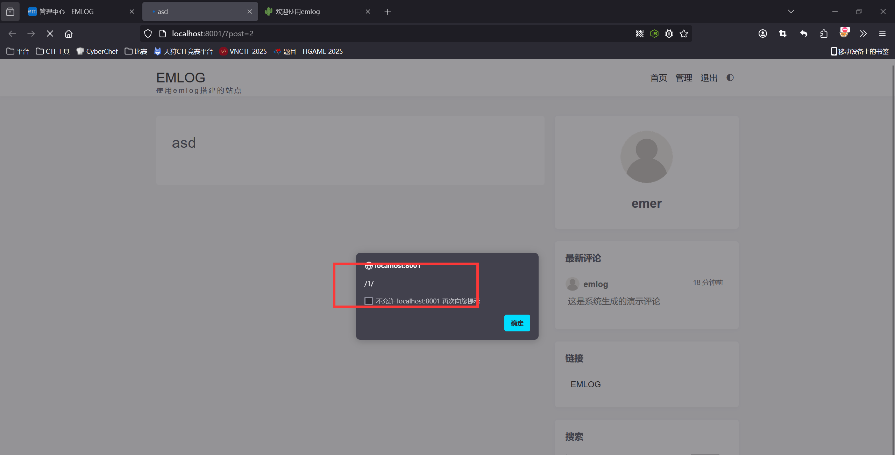
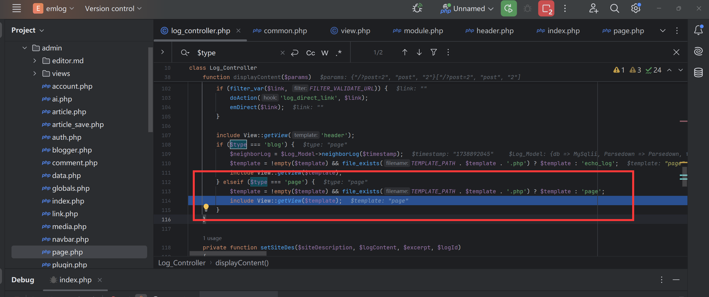
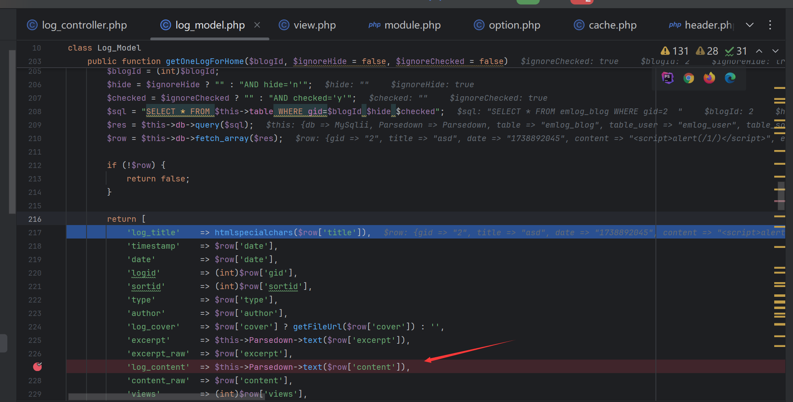
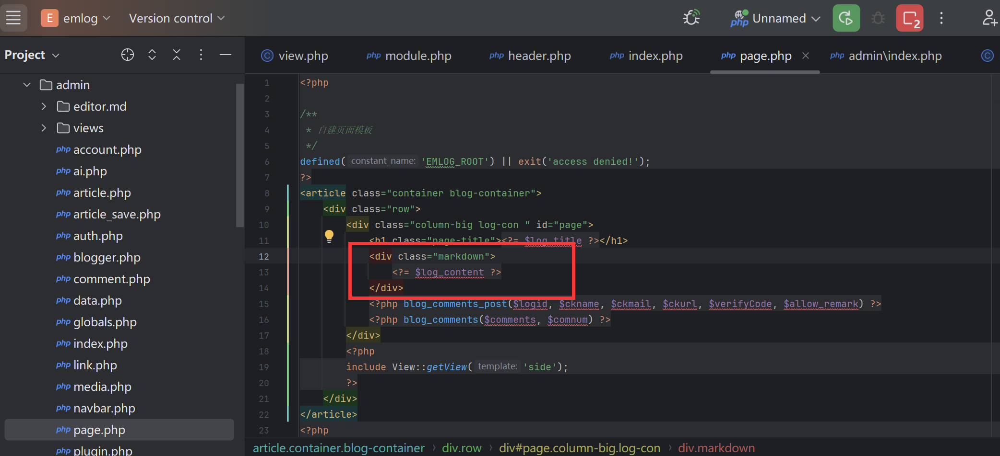

### Vulnerability Description  

There are stored XSS vulnerabilities in the page rendering function of the latest version of EmlogPro 2.5.4. These vulnerabilities occur due to insufficient input validation and sanitization, allowing attackers to inject malicious scripts into the database, and then when the page function is clicked, malicious code will be automatically inserted into the page to trigger the XSS vulnerability.

Official website: [https://www.emlog.net/](https://www.emlog.net/)  
Source code repository: [https://www.emlog.net/download](https://www.emlog.net/download)  
Source code version and download link:  
EmlogPro 2.5.4 - (2025-01-25 latest version)


### Attack Example  
Create a new page  


Add the following content as the PoC:  
```r
<script>alert(/1/)</script>
```


Then open the newly created page  


Successfully triggers the XSS vulnerability. The URL is: `localhost/?post=2` where the `post` parameter is the page's ID  


### Debugging Analysis

The new page URL: `localhost/?post=2` directly fetches the page content (`log_content`) from the database without any checks during rendering  


Eventually, it reaches the file inclusion template in `include/controller/log_controller.php` and loads the `content/templates/default/page.php` file  


In `content/templates/default/page.php`, the page content is directly output without filtering  
