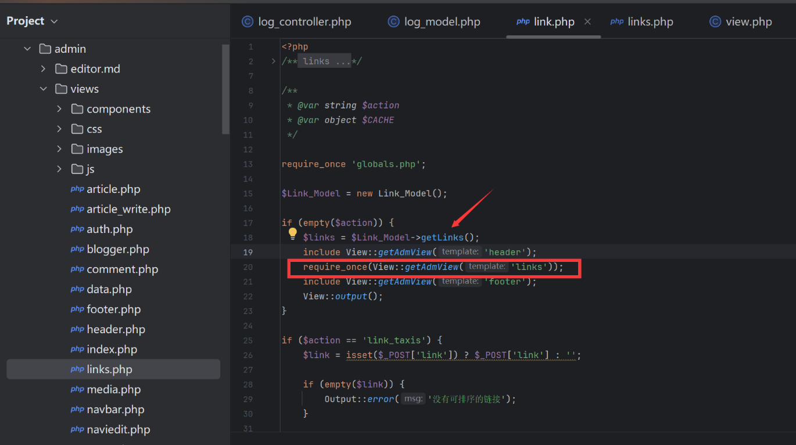

### Vulnerability Description  

EmlogPro latest version 2.5.4 has a stored XSS vulnerability in its link rendering functionality. These vulnerabilities occur due to insufficient input validation and sanitization, allowing attackers to inject malicious scripts into the database. When clicking on the link functionality, the malicious code is automatically inserted into the page and triggers the XSS vulnerability.


Official website: [https://www.emlog.net/](https://www.emlog.net/)  
Source code repository: [https://www.emlog.net/download](https://www.emlog.net/download)  
Source code version and download link:  
EmlogPro 2.5.4 - (2025-01-25 latest version)
### Attack Example  
The URL requires an HTTP link, and we bypass the input by using the comment symbol to write the PoC:  
```r
http://127.0.0.1/#" onfocus="alert('xss');" autofocus="
```


Clicking the link triggers the XSS vulnerability. The URL is `http://localhost:8001/admin/link.php`  


### Debugging Analysis  
Upon debugging, we found that accessing `admin/link.php` without parameters calls the `getLinks` function, which then includes `admin/views/links.php`  


We discovered that after `getLinks` retrieves the property values from the database, it does not filter the `siteurl` and directly returns it, assigning it to `links`  


The template `admin/views/links.php` then directly concatenates the `siteurl` from `links` into the HTML page, causing the XSS vulnerability  

