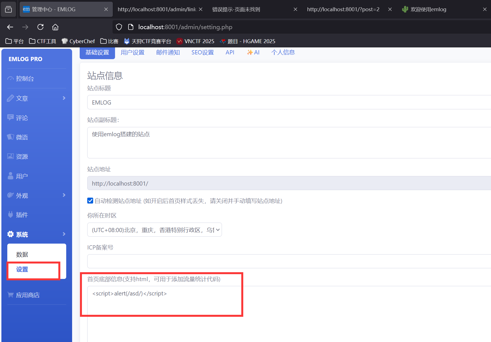
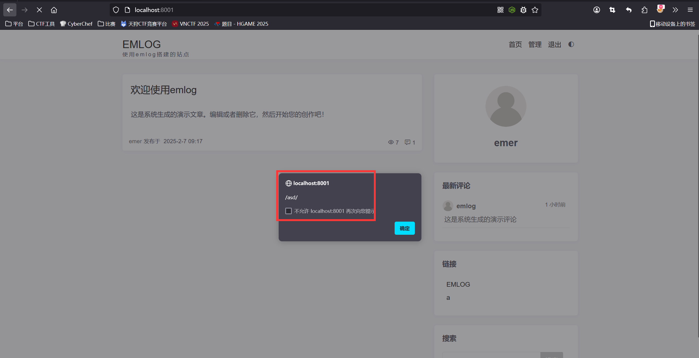
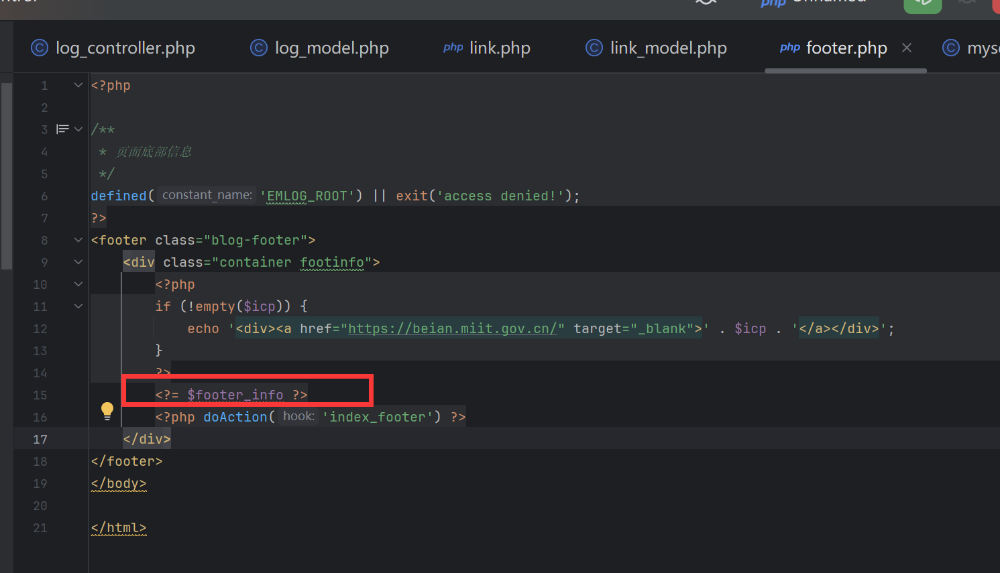

### Vulnerability description

There are stored XSS vulnerabilities in the information rendering at the bottom of the page in the latest version of EmlogPro 2.5.4. These vulnerabilities occur due to insufficient input validation and sanitization, allowing attackers to inject malicious scripts into the database. Then when entering the homepage of the website, malicious code will be automatically inserted into the page to trigger the XSS vulnerability.

Official website: [https://www.emlog.net/](https://www.emlog.net/)  
Source code repository: [https://www.emlog.net/download](https://www.emlog.net/download)  
Source code version and download link:  
EmlogPro 2.5.4 - (2025-01-25 latest version)

### Attack Example  
In the backend, go to the system settings and add the PoC in the footer page information:  
```r
<script>alert(/asd/)</script>
```

Then visit the homepage, and the XSS vulnerability will be triggered  


Upon debugging, we found that the code eventually directly outputs the `$footer_info` variable in `content/templates/default/footer.php` without any sanitization or filtering  
