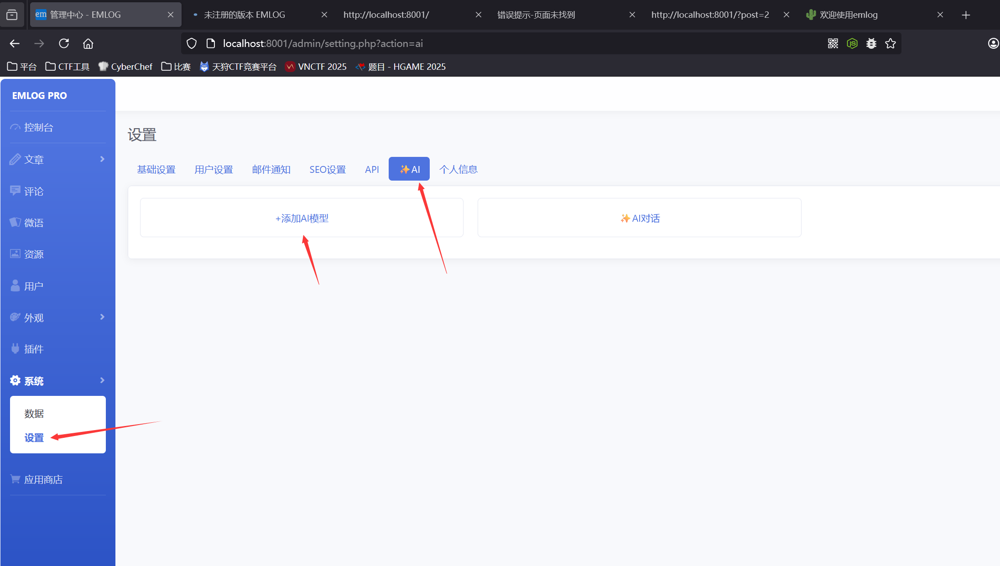
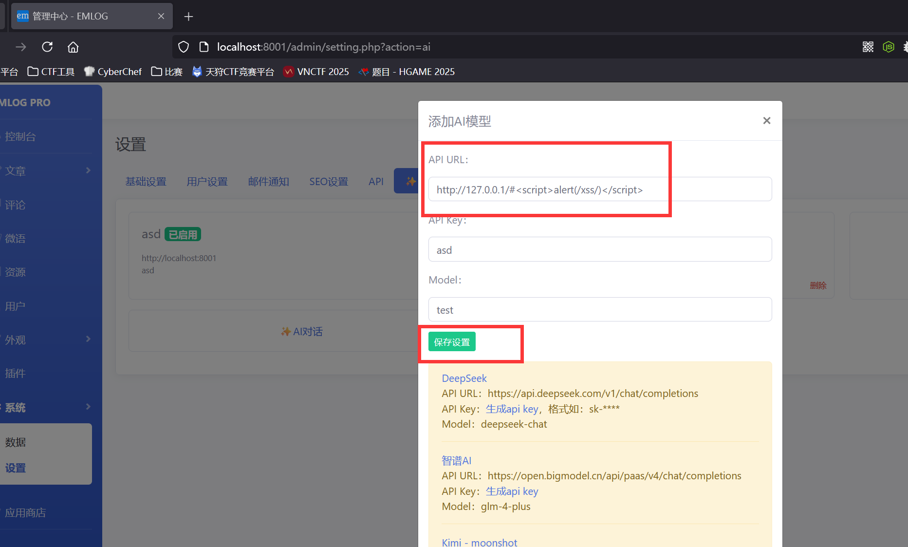
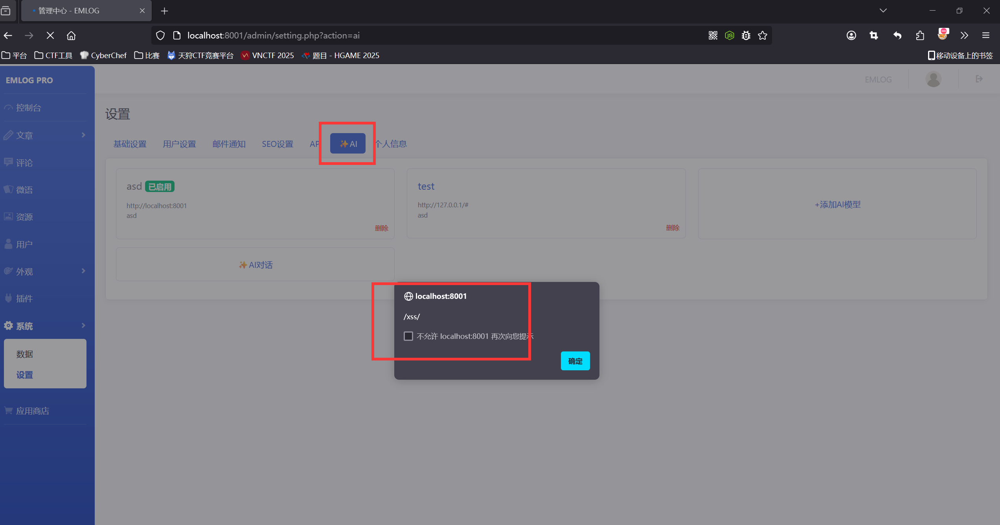
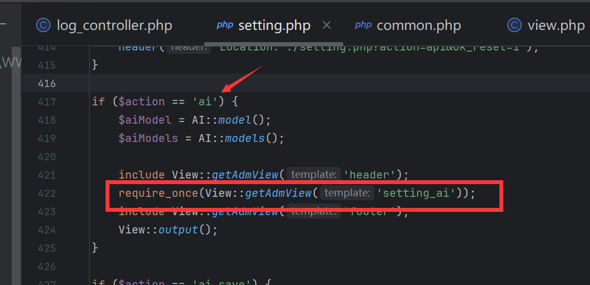
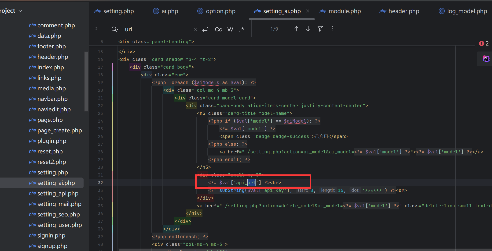

### Vulnerability Description  

EmlogPro latest version 2.5.4 has a stored XSS vulnerability in the AI page. These vulnerabilities occur due to insufficient input validation and sanitization, allowing attackers to inject malicious scripts into the database. When entering the AI settings page, the malicious code is automatically inserted into the page and triggers the XSS vulnerability.

### Attack Example  
In the backend system settings, add an AI model under the AI functionality  


Then in the API URL field, write the PoC:  
```r
http://127.0.0.1/#<script>alert(/xss/)</script>
```



After saving, clicking on the AI module will trigger the XSS vulnerability  



Upon debugging, we found that when passing the `ai` parameter in `admin/setting.php`, it includes the template `admin/views/setting_ai.php`  



Finally, `admin/views/setting_ai.php` directly outputs the `api_url` into the HTML page, causing the XSS vulnerability  

