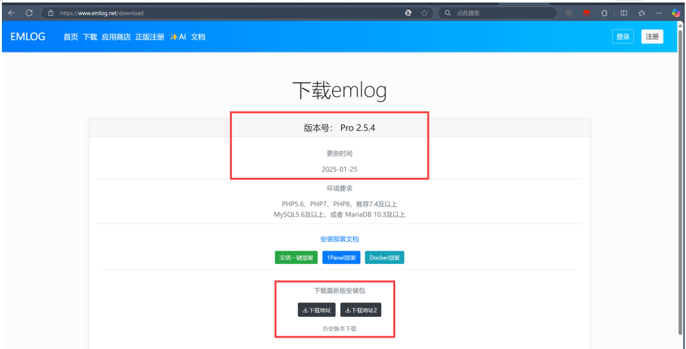

## Vulnerability Description
There is a stored XSS vulnerability in `article_save.php` of the latest version 2.5.4 of EmlogPro. This vulnerability occurs due to insufficient input validation and sanitization, allowing an attacker to inject malicious scripts into web pages that are then executed in the browsers of other users.

Official website: [https://www.emlog.net/](https://www.emlog.net/)  
Source code repository: [https://www.emlog.net/download](https://www.emlog.net/download)  
Source code version and download link:  
EmlogPro 2.5.4 - (2025-01-25 latest version)

## Code Review Process
During the audit of `article_save.php`, it was found that there is insufficient filtering of the input parameters, and the `postStrVar` function was traced.

The content of the `postStrVar` function is as follows:  
`addslashes(trim($str))` first removes whitespace from both ends of the string and then escapes special characters in the string.

However, it is still possible to bypass this by omitting quotes: ``

## Vulnerability Exploitation Process
In the backend, when writing an article, input the XSS proof of concept (POC):  
``, then directly publish it.  

By intercepting the request, the full HTTP request can be seen as follows:

Then, when visiting the homepage and clicking on the published article, the XSS will successfully trigger:
  
